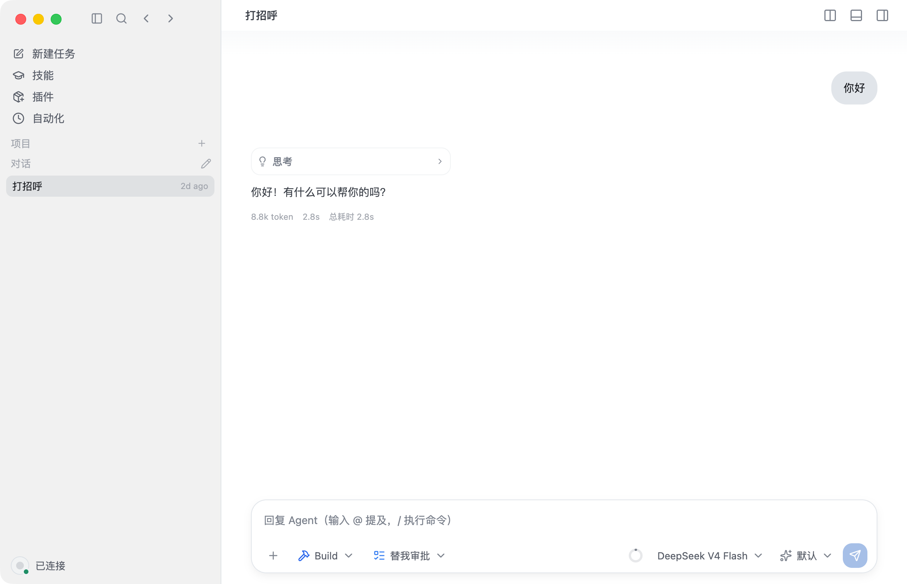

<p align="center">
  <a href="https://opencode.ai">
    <picture>
      <source srcset="packages/console/app/src/asset/logo-ornate-dark.svg" media="(prefers-color-scheme: dark)">
      <source srcset="packages/console/app/src/asset/logo-ornate-light.svg" media="(prefers-color-scheme: light)">
      
    </picture>
  </a>
</p>
<p align="center">开源的 AI Coding Agent 桌面端。</p>
<p align="center">
  <a href="https://opencode.ai/discord"></a>
  <a href="https://www.npmjs.com/package/opencode-ai"></a>
  <a href="https://github.com/anomalyco/opencode/actions/workflows/publish.yml"></a>
</p>


[](https://opencode.ai)

---

### 安装

#### 1、源码打包
```bash
# clone源码
git clone https://github.com/ihankun/opencodex.git           # 使用 electron 分支

# 安装依赖
bun install
bun run electron:install

# 本地开发
bun run electron:dev

# mac打包
bun run electron:package
# win打包
bun run electron:win
```
> [!TIP]
> dev 分支为fork的原版opencode代码分支。

#### 2、桌面应用程序
可直接从[发布页](https://github.com/ihankun/opencodex/releases)下载。

### Agents

OpenCode 内置两种 Agent，可用 `Tab` 键快速切换：

- **build** - 默认模式，具备完整权限，适合开发工作
- **plan** - 只读模式，适合代码分析与探索
  - 默认拒绝修改文件
  - 运行 bash 命令前会询问
  - 便于探索未知代码库或规划改动

另外还包含一个 **general** 子 Agent，用于复杂搜索和多步任务，内部使用，也可在消息中输入 `@general` 调用。

了解更多 [Agents](https://opencode.ai/docs/agents) 相关信息。

### 文档

更多配置说明请查看我们的 [**官方文档**](https://opencode.ai/docs)。

### 参与贡献

如有兴趣贡献代码，请在提交 PR 前阅读 [贡献指南 (Contributing Docs)](./CONTRIBUTING.md)。

### 基于 OpenCode 进行开发

如果你在项目名中使用了 “opencode”（如 “opencode-dashboard” 或 “opencode-mobile”），请在 README 里注明该项目不是 OpenCode 团队官方开发，且不存在隶属关系。

---

**加入我们的社区** [飞书](https://applink.feishu.cn/client/chat/chatter/add_by_link?link_token=52ao9352-5623-4fa0-b7dd-3407c392c1af&qr_code=true) | [X.com](https://x.com/opencode)
